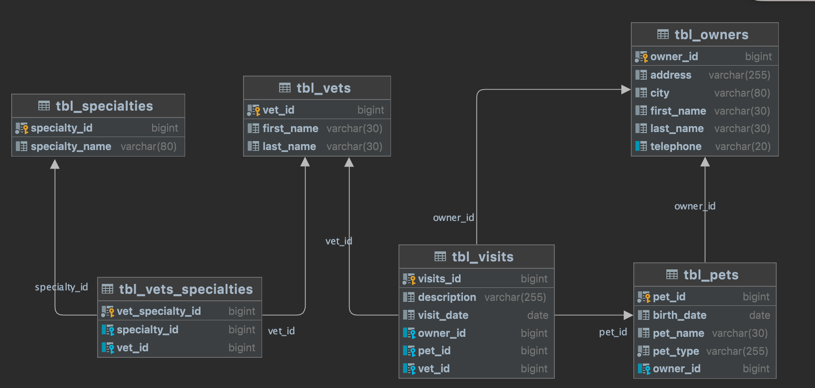

# Pet Clinic Server
> Monolitic 기반의 사이드 프로젝트입니다.
- 프로젝트 기간 : 2023.03.21 - continue

### 개발환경 / 사용기술
- 개발환경
  - Java 17, Spring Boot 3.0.4, Gradle
  - Git, MySQL, H2
  - JUnit5
- 사용 기술  
  - Spring Data JPA, @Query, QueryDSL
  - MapStruct, Exception Handling
  - Spring AOP

## ERD
